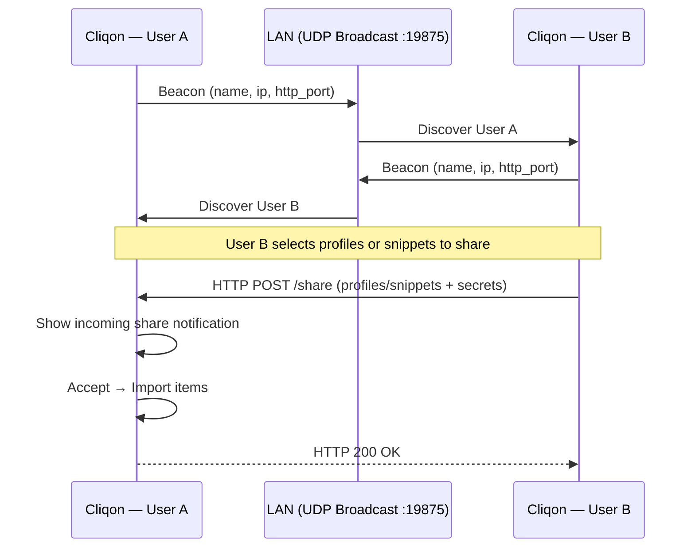

# Cliqon — Modern SSH & SFTP Client

[](https://github.com/genc-murat/cliqon/releases)
[](https://github.com/genc-murat/cliqon/actions)
[](LICENSE)
[](https://github.com/genc-murat/cliqon/blob/main/CHANGELOG.md)
[](https://github.com/genc-murat/cliqon/releases)

Cliqon is a fast, feature-rich SSH terminal and SFTP file manager for the desktop. Built with **Tauri 2** (Rust backend) and a **React + TypeScript** frontend, it offers a premium, modern experience for developers and DevOps engineers.

> [!TIP]
> **Get Started:** Download the latest version for your OS from the [Releases](https://github.com/genc-murat/cliqon/releases) page.

---

## Why Cliqon?

While there are many SSH clients, Cliqon is built for the **modern developer workflow**:
- **Performance First:** Native performance with a Rust backend (Tauri 2) and WebGL-accelerated terminal.
- **Seamless Collaboration:** Zero-config, P2P network sharing to securely send profiles to teammates.
- **Intelligence:** ML-powered autocomplete that learns your habits locally and privately.
- **Integrated Toolbox:** Docker management, server health monitoring and 30+ network diagnostic tools built-in.
- **Deep Customization:** 39+ premium themes and fine-grained UI control.

---

## Architecture

```mermaid
graph TB
    subgraph Frontend ["Frontend — React + TypeScript"]
        UI["UI Components<br/>(Sidebar, TopBar, TitleBar)"]
        Terminal["Terminal Viewer<br/>(xterm.js + WebGL)"]
        SFTP["SFTP File Browser"]
        Docker["Docker Manager"]
        Sharing["Sharing Panel"]
        NetTools["Network Tools"]
        Monitor["Server Monitor"]
        CronManager["Cron Manager"]
        EnvManager["Env Manager"]
        KeyStore["SSH Key Store"]
        ML["ML Autocomplete<br/>(Markov Chain)"]
        Settings["Settings & Themes"]
        CommandPalette["Global Command Palette<br/>(Ctrl+K)"]
    end

    subgraph IPC ["Tauri IPC Bridge"]
        Commands["Tauri Commands<br/>(invoke handlers)"]
    end

    subgraph Backend ["Backend — Rust"]
        ProfileStore["Profile Store<br/>(profiles.json + Keyring)"]
        SSHMgr["SSH Manager<br/>(ssh2 PTY sessions)"]
        SFTPMgr["SFTP Manager<br/>(file ops)"]
        DockerSvc["Docker Service<br/>(container mgmt)"]
        SharingSvc["Sharing Service<br/>(UDP Discovery + HTTP)"]
        MonitorSvc["Monitor Service<br/>(system metrics)"]
        NetToolSvc["Net Tool Service<br/>(diagnostics)"]
        LogMgr["Log Manager<br/>(tail streaming)"]
        ImportSvc["Import Service<br/>(MobaXterm, Termius)"]
        AuthSvc["Auth Service<br/>(keyring, obfuscation)"]
    end

    subgraph OS ["OS & Network Layer"]
        Keyring["OS Keyring<br/>(Keychain / libsecret / WCM)"]
        FS["Filesystem<br/>(app data dir)"]
        LAN["Local Network<br/>(UDP :19875 + HTTP)"]
        SSH["SSH Servers<br/>(remote hosts)"]
    end

    UI --> Commands
    Terminal --> Commands
    SFTP --> Commands
    Docker --> Commands
    Sharing --> Commands
    NetTools --> Commands
    Monitor --> Commands
    CronManager --> Commands
    KeyStore --> Commands
    CommandPalette --> Commands

    Commands --> ProfileStore
    Commands --> SSHMgr
    Commands --> SFTPMgr
    Commands --> DockerSvc
    Commands --> SharingSvc
    Commands --> MonitorSvc
    Commands --> NetToolSvc
    Commands --> LogMgr
    Commands --> ImportSvc

    ProfileStore --> Keyring
    ProfileStore --> FS
    AuthSvc --> Keyring
    SharingSvc --> LAN
    SSHMgr --> SSH
    SFTPMgr --> SSH
    DockerSvc --> SSH
    MonitorSvc --> SSH
    NetToolSvc --> SSH
    LogMgr --> SSH

    style Frontend fill:#1a1a2e,stroke:#6c63ff,color:#e0e0e0
    style Backend fill:#16213e,stroke:#0f3460,color:#e0e0e0
    style IPC fill:#0f3460,stroke:#533483,color:#e0e0e0
    style OS fill:#1a1a2e,stroke:#533483,color:#e0e0e0
```



### Network Sharing Flow



---

## Features

### Connection Management
- Save, edit, and delete SSH connection profiles
- **Connection Importing** — easily migrate from **MobaXterm** (`.mxtsessions`) or **Termius** (JSON) with a single click
- **Connection Groups** — organize profiles into collapsible groups in the sidebar; state is persisted across restarts
- **Favorites** — star any connection to pin it to the top of the list
- **Color Accents** — assign a custom color per connection (left-border highlight + subtle background tint in the sidebar)
- **Search & Filter** — real-time search by profile name, hostname, or username; groups are intelligently displayed in search results
- Supports **Password**, **Private Key**, and **SSH Agent** authentication

### 🔗 Network Sharing
Share SSH connection profiles and global snippets with teammates on the same local network — no server required:
- **Global Active Indicator** — A continuous status indicator in the top TitleBar displays when sharing is active, with a notification badge for incoming share requests. You can click it from anywhere to open the panel.
- **Auto-Discovery** — Cliqon instances on the same LAN automatically discover each other via UDP broadcast (port `19875`)
- **Profile & Snippet Sharing** — Select one or more profiles or snippets and send them directly to a discovered peer; passwords and keys are included for profiles.
- **Incoming Share Notifications** — Received shares appear as interactive cards with item details; one-click **Accept** imports directly into your connection or snippet list.
- **Display Name** — Set a custom display name (defaults to hostname) so teammates know who's sharing
- **Zero Configuration** — No central server, no cloud, no accounts; works entirely peer-to-peer on your LAN
- **Privacy-First** — All data stays on your network; sharing is opt-in and each share request can be individually accepted or rejected
- **Cross-Platform** — Seamlessly share between **Windows, macOS, and Linux**. Works across different operating systems on the same network.
- **Firewall Friendly** — Uses standard ports. (Note: Ensure your system firewall allows traffic on UDP port `19875` for discovery).

### Terminal
- **xterm.js** rendering with **WebGL** acceleration for smooth, low-latency output
- **Split Terminal** — split any tab horizontally (`Ctrl+Shift+H`) to run multiple SSH sessions to the same host side-by-side
- **Draggable Dividers** — interactively resize terminal panes within a tab
- **Multi-Tab** — run multiple independent SSH sessions
- **Terminal Themes** — 35+ built-in themes including Night Owl, Cobalt2, Catppuccin, Rose Pine, Tokyo Night, One Dark, Neon Tokyo, Vaporwave, Aurora Borealis, and many more
- **Cursor Customization** — Choose between Block, Underline, or Bar cursor styles with optional blinking
- **Dynamic ANSI Colors** — "Match App Theme" automatically switches between Light and Dark optimized ANSI palettes for maximum readability
- **Font Settings** — choose font family, size, and line height with a live preview
- **Advanced Terminal Features**:
    - **Find & Replace (`Ctrl+F`)**: Full-featured search bar; case-sensitive and regex support for searching within the terminal buffer.
    - **Command History Search (`Ctrl+R`)**: Interactive reverse-i-search feature to quickly find and execute commands from your history (machine learning-powered).
    - **Clickable URLs**: Automatically detects and opens web addresses in your default browser when clicked.
    - **Line Numbers (`Ctrl+Shift+L`)**: Optionally display line numbers in the scrollback buffer.
    - **Clipboard Integration**: Enhanced copy/paste functionality.
- **ML-Powered Autocomplete** — Fish-shell style inline suggestions that learn from your history using a Markov Chain model; accepts with `Tab` or `→`

### SFTP File Browser
- Integrated split-view SFTP panel per terminal tab
- Directory navigation (double-click to open, Up button to go back)
- **Multi-Selection** — Select multiple files using `Ctrl+Click` or `Shift+Click` for bulk operations.
- **Batch ZIP Download** — Download multiple files and folders at once as a single ZIP archive.
- **Real-Time Watching** — Toggle "Watch Mode" to automatically refresh the directory list when files change on the server.
- **Transfer Queue** — Monitor active uploads and downloads with matching-width progress panel at the bottom.
- **Custom Modals** — Premium, theme-aware prompt dialogs for file operations instead of native browser prompts.
- **Drag-and-drop** file upload from your desktop into the remote directory
- **SFTP Bookmarks** — Save frequent paths per connection for instant access.
- **Built-in Editor** — Edit remote files with syntax support and `Sudo Edit` capability.
- **Tail Log** — Live streaming viewer for `.log` files with real-time filtering.
- **Properties & Permissions** — View details and edit `chmod` permissions interactively.
- Refresh button, Copy Path, and file size display on hover.

### Global Connection Snippets
- **Global Library** — Save your most-used commands globally to access them across any SSH profile or connection.
- **Folder Organization** — Group snippets logically (e.g., "Docker", "Updates", "Network").
- **Auto-run Toggle** — Choose whether a snippet executes instantly upon clicking, or just pastes into the terminal buffer for further editing.
- Add, edit, or delete snippets with a clean, collapsable sidebar panel.

### SSH Tunneling (Port Forwarding)
- **Local & Remote Forwarding** — Securely expose local services to the remote host, or access remote internal services on your local machine.
- **Dynamic Port Forwarding (SOCKS5)** — Route your browser traffic securely through the SSH connection without complex command line flags.
- **Dedicated Management Panel** — Add, edit, and toggle tunnels directly from a new "Tunnels" tab without opening a terminal session.
- **Background Execution** — Tunnels run in lightweight Rust threads, ensuring high throughput and resilience.
 
### SSH Key Management & Auditing
Manage your authentication identities securely and contextually:
- **Global Key Store** — Integrated into the Settings modal for managing local SSH keys; generate new keys or import existing ones with optional passphrases.
- **Algorithm Support** — Generate modern **ED25519** (recommended), RSA, or ECDSA key pairs.
- **SHA256 Fingerprinting** — Every key is automatically analyzed to display its unique fingerprint, type, and bit-length.
- **Remote Deployment** — Deploy your local public keys to any connected server with one click through the Management Panel.
- **Security Auditing** — Interactively view the remote server's `authorized_keys` file. Cliqon automatically identifies and labels keys that match your local identities, making it easy to see who has access.
- **One-Click Cleanup** — Safely remove unauthorized or old keys from remote servers without manual editing.

### Cron Job Manager
Easily manage repeating tasks on your remote servers:
- **Visual Management** — List, create, and delete cron jobs without manually editing crontab files.
- **Preset Schedules** — Quickly set up common intervals (Every minute, hourly, daily, etc.) or use custom expressions.
- **Execution History** — Monitor the history and logs of your cron tasks directly from the Management Panel.

### Theming & Appearance
- **App Themes** — 39+ high-quality themes: Mint Frost, Golden Sand, Sky Blue, Soft Lilac, Desert White, Sage Garden, Sunset Glow, Lemon Chiffon, Cyberpunk Red, Hacker Void, Neon Tokyo, Vaporwave, and many more.
- **Theme Grouping** — Reorganized preferences UI with themes categorized into **Light** and **Dark** groups for easier selection.
- **Sidebar-Driven Settings** — Completely redesigned, premium settings interface for easier customization.
- **Modern Icons** — Refined UI with modern panel icons for collapse/expand functionality across the Sidebar, SFTP, and Snippets panels.

### ⌨️ Global Command Palette
Manage every aspect of the application without leaving your keyboard:
- **Instant Access (`Ctrl + K`)** — Open a keyboard-first command hub to search profiles and execute actions.
- **Terminal Control** — Live toggle for cursor styles, font sizes, and performance counters.
- **Layout Management** — Toggle sidebar views (Cards/Compact), split panes, and visibility of snippets/SFTP panels.
- **System Actions** — Quick access to management tools, update checks, and secure exit.
- **Connection Hub** — Search and launch SSH connections directly from the palette.

### Security
- Passwords and key passphrases stored via **OS Keyring** (Keychain on macOS, libsecret on Linux, Windows Credential Manager)
- Obfuscated local fallback for environments where the system keyring is unavailable
- **Auto-Locking & Session Timeout** — Automatically locks the application and forcefully closes backend SSH/SFTP connections after inactivity (configurable 5m-1h). Features a secure overlay with quick-reconnect ('R') and the ability to close specific locked tabs ('Esc' or Close button).

### Server Health Monitor
- **Real-Time Dashboard** — Live CPU, RAM, Disk, and Load Average metrics
- **Visual Analytics** — Integrated circular gauges and SVG sparkline charts with historical tracking
- **Dynamic Thresholds** — Professional color-coded indicators (Green/Amber/Red) for instant health status
- **↔ Vertically Resizable** — Adjust the monitor panel height by dragging the top handle; height is persisted per user pref
- **Auto-Open Preference** — Optional "Auto-open on connection" setting configurable via General Settings
- **System Insights** — Fast parsing of Hostname, OS Distribution, and Uptime via background SSH exec commands
- **System Services Manager** — Manage `systemctl` units directly; list, search, start, stop, and restart services without typing commands.
- **Systemd Timer Management**: Monitor and manage scheduled tasks (timers); view next run times, time remaining, and last execution results with interactive controls.
- **Environment Variable Manager**: List, add, edit, and delete environment variables with persistent storage in `~/.bashrc` via a dedicated management tab.

### Network Tools
A comprehensive suite of **30+ on-demand diagnostic tools** executed directly from the connected server via SSH, now organized into a logical two-pane layout:
- **Diagnostics**:
  - **Ping & Traceroute** — Latency sparklines, min/avg/max stats, and hop visualization.
  - **DNS & Nslookup** — Query records with color-coded type badges.
  - **MTR & Tracepath** — Advanced path and performance analysis.
  - **Curl Timing** — Detailed latency breakdown (DNS, Connect, App Connect, Transfer) for any URL.
- **Status & Monitoring**:
  - **Active Connections** — Real-time list of TCP/UDP connections.
  - **Listening Ports** — Audit all ports the server is currently listening on.
  - **System Metrics** — Instant check for **Uptime**, **Disk Usage**, **Memory**, and **Hostname** info.
  - **Netstat** — View kernel routing tables and interface statistics.
- **Server Infrastructure**:
  - **Interfaces** — View local network interfaces and assigned IP addresses.
  - **DNS Config** — Quickly inspect `/etc/resolv.conf`.
  - **Hosts File** — View the server's local host mappings.
  - **Public IP** — Identify the server's external presence.
- **Security & Auditing**:
  - **Port Scan & Nmap** — Scan remote hosts for common services and advanced auditing.
  - **SSL Info** — Detailed certificate info (Validity, Issuer, SANs) for secure hosts.
  - **Fail2Ban** — Monitor intrusion prevention status and banned IPs.
  - **Firewall** — Instant status check for `ufw` or `iptables` rules.
  - **Last Logins** — Audit recent access history.
- **Advanced Tools**:
  - **Active Users** — See who else is currently logged into the server.
  - **Open Files** — List open files and network sockets via `lsof`.
- **Power-User Ready**:
  - **Categorized UI** — Left-sidebar navigation for quick switching between tool groups.
  - **Structured Output** — Raw shell data is parsed into clean, interactive tables and cards.
  - **Copy Raw** — One-click clipboard copy of raw command output.

### Docker Architecture & Container Manager
Manage your Docker infrastructure directly through the SSH connection:
- **Container List** — Real-time view of all containers (Running, Stopped, Exited).
- **Search & Filter** — Search containers by name, image, or ID. Filter by state (All/Running/Stopped).
- **Live Performance Stats** — Monitor real-time CPU and Memory (RAM) usage directly in the container list.
- **Container Inspect** — View detailed container information including environment variables, mounts, network settings, and health check status.
- **Log Viewer** — Dedicated Logs tab with search (including regex), line count selection, auto-scroll, and color-coded output.
- **Network Management** — New Networks tab to list, create, and remove Docker networks (bridge, host, none drivers).
- **Real-time Events** — New Events tab to monitor Docker events in real-time with type filtering and color-coded output.
- **Docker Compose** — Right-click context menu on `docker-compose.yml` files to Start, Stop, Pause, Resume, or View Services.
- **Interactive Shell (Exec)** — Drop into a running container's shell (`bash` or `sh`) with a single click, right inside your active terminal.
- **Prune Options** — Redesigned prune dropdown to clean up containers, networks, images, or volumes individually or all at once.
- **Bulk Actions** — Select multiple containers at once to perform concurrent Start, Stop, Kill, and Restart operations.
- **Compose Visualizer** — Right-click any `docker-compose.yml` file in the SFTP browser to automatically generate an interactive architecture diagram.
- **Volume Browser** — List system volumes and browse their simulated internal filesystem without manually exec-ing into containers.
- **Port Manager** — Clean, extracted view of active port mappings with one-click clickable links to launch services in the browser.
- **Terminal Log Stream** — Stream `docker logs -f` directly into your active terminal tab.
- **One-Click Controls** — Start, stop, and restart containers instantly.
 
### ML-Powered Terminal Autocomplete
Experience a smarter terminal that learns how you work. Cliqon includes a built-in, privacy-first machine learning engine that provides intelligent command suggestions:
- **Predictive Suggestions** — As you type, a light ghost-text suggestion appears ahead of your cursor.
- **Context-Aware Learning** — Uses a **Markov Chain + N-gram** model to learn your common command sequences (e.g., it learns that `git add .` is often followed by `git commit`).
- **Frecency Algorithm** — Suggestions are ranked based on frequency and recency, ensuring your most relevant commands are always at your fingertips.
- **Tab to Accept** — Press `Tab` or `→` to instantly complete the suggestion; press `Esc` to dismiss.
- **Interactive Detection** — Automatically pauses suggestions when you're in full-screen programs like `vim`, `nano`, or `htop`.
- **Local & Private** — All learning and prediction happens entirely on your machine; no command history is ever sent to the cloud.

### ↕ Resizable Panels & Layout
- **Intelligent Resizing** — Interactively drag to resize the Sidebar, SFTP Browser, Snippet Manager, and Server Monitor
- **Layout Persistence** — All panel widths and the monitor height are saved to local storage
- **Terminal Reflow** — xterm.js automatically adjusts columns and rows when panels are resized or collapsed

### Built-in Text Editor
- **Remote Editing** — Modify files directly on the server without manual download/upload cycles
- **Syntax Highlighting** — Automatic language detection for code and config files
- **Developer Ready** — Line numbers, monospace gutter, and `Ctrl+S` instant save integration

### Keyboard Shortcuts
| Shortcut | Action |
|---|---|
| `Ctrl + K` | Open Global Command Palette |
| `Ctrl + Tab` | Switch to next SSH tab |
| `Ctrl + Shift + Tab` | Switch to previous SSH tab |
| `Ctrl + N` | Open "New Connection" modal |
| `Ctrl + B` | Toggle SFTP browser panel |
| `Ctrl + F` | Focus sidebar search / Show Terminal search bar |
| `Ctrl + R` | Interactive command history search (reverse-i-search) |
| `Ctrl + Shift + L` | Toggle terminal line numbers |
| `Ctrl + Shift + H` | Split current tab horizontally |

---

## Technology Stack

| Layer | Technology |
|---|---|
| Desktop runtime | Tauri v2 |
| Backend | Rust (`ssh2`, `keyring`, `serde`, `tiny_http`) |
| Frontend | React 19 + Vite + TypeScript |
| Terminal | xterm.js + WebGL addon |
| Network Sharing | UDP Broadcast + HTTP (peer-to-peer) |
| Icons | Lucide React |
| Styles | Tailwind CSS + CSS variables |

---

## Getting Started

### Prerequisites
- [Rust](https://rustup.rs/) (stable)
- [Node.js](https://nodejs.org/) v18+
- Tauri prerequisite libraries — see [Tauri Prerequisites](https://tauri.app/start/prerequisites/)

### Install dependencies
```bash
npm install
```

### Development
```bash
npm run tauri dev
```

### Production build (current platform)
```bash
npm run tauri build
```

### Cross-compile for Windows (from Linux)
```bash
npm run tauri build -- --target x86_64-pc-windows-gnu
```

---

## Contributing
Issues and PRs are welcome. If you'd like to add a feature or fix a bug, feel free to open a discussion first.
